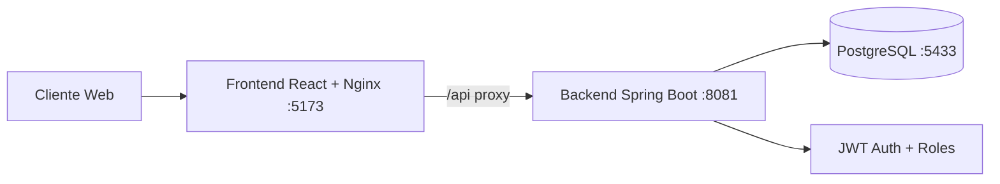
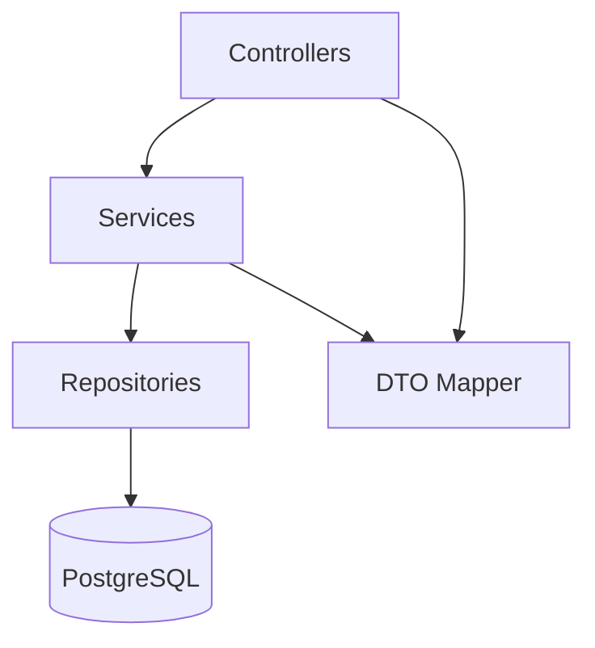
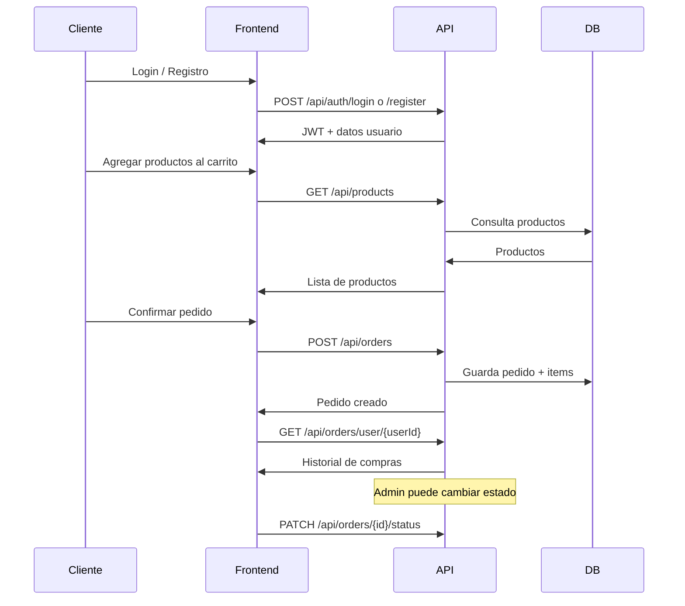
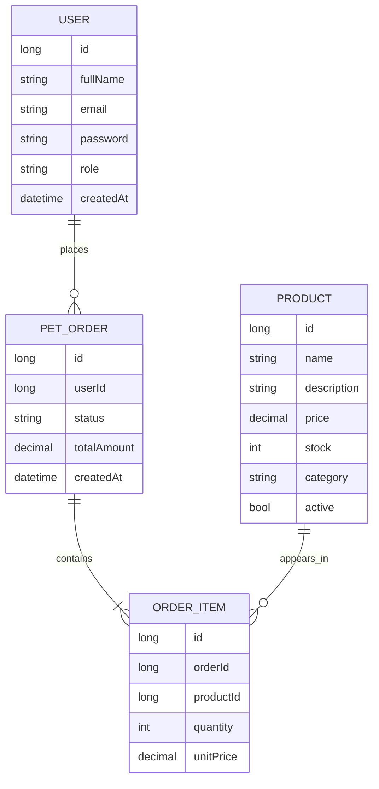

# Huellitas Shop - Plataforma Full Stack

Huellitas Shop es una tienda online de mascotas con backend en Spring Boot, frontend en React y despliegue local completo con Docker Compose.

## 1) Estado Docker: como debe quedar

Comando para levantar todo:

```powershell
docker compose up --build -d
```

Comando para validar estado:

```powershell
docker compose ps
```

Resultado esperado (equivalente):

- petshop-frontend: Up en puerto 5173->80
- petshop-backend: Up en puerto 8081->8080
- petshop-db: Up (healthy) en puerto 5433->5432

URLs finales:

- Frontend: http://localhost:5173
- Backend API: http://localhost:8081/api
- PostgreSQL host: localhost:5433

Detener servicios:

```powershell
docker compose down
```

Reset total (incluye base de datos):

```powershell
docker compose down -v
docker compose up --build -d
```

## 2) Arquitectura general

Arquitectura backend por capas (estilo MVC para API REST):

- Controller: recibe peticiones HTTP y devuelve respuestas.
- Service: aplica reglas de negocio.
- Repository: acceso a PostgreSQL con Spring Data JPA.
- Entity: modelo persistente.
- DTO: contratos de entrada/salida de la API.

Esto facilita mantenimiento, pruebas y escalabilidad.

## 3) Diagrama de arquitectura



## 4) Diagrama de capas backend



## 5) Flujo funcional de compra



### Modelo de datos (ER)



## 6) Zona horaria y moneda

- Zona horaria backend: America/Bogota.
- Serializacion JSON: America/Bogota.
- Visualizacion en frontend: locale es-CO + America/Bogota.
- Moneda en frontend: COP (pesos colombianos).

## 7) Estructura del proyecto

```text
PetShop/
  backend/
    src/main/java/com/petshop/
      config/
      controller/
      dto/
      entity/
      exception/
      repository/
      security/
      service/
    src/main/resources/application.yml
    Dockerfile
  frontend/
    src/
      components/
      context/
      pages/
      services/
      utils/
    docker/nginx.conf
    Dockerfile
  docker-compose.yml
  .env.docker.example
```

## 8) Seguridad y acceso

- Auth publica:
  - POST /api/auth/register
  - POST /api/auth/login
- Productos publicos:
  - GET /api/products
  - GET /api/products/{id}
- Resto de endpoints: requieren Bearer token JWT.
- Control por rol:
  - ADMIN: gestion completa de usuarios, productos y pedidos.
  - CUSTOMER: crear/ver pedidos (segun endpoint habilitado).

Header requerido para endpoints protegidos:

```text
Authorization: Bearer <token>
```

## 9) Credenciales iniciales

- Email admin: admin@petshop.com
- Password admin: Admin123!

## 10) Catalogo completo de endpoints

Base URL: http://localhost:8081/api

### Auth

| Metodo | Endpoint | Auth | Rol | Descripcion |
|---|---|---|---|---|
| POST | /auth/register | Publico | N/A | Registra usuario y devuelve token |
| POST | /auth/login | Publico | N/A | Login y devuelve token |

### Usuarios

| Metodo | Endpoint | Auth | Rol | Descripcion |
|---|---|---|---|---|
| GET | /users | JWT | ADMIN | Lista usuarios |
| GET | /users/{id} | JWT | ADMIN | Obtiene usuario por id |
| POST | /users | JWT | ADMIN | Crea usuario |
| PUT | /users/{id} | JWT | ADMIN | Actualiza usuario |
| DELETE | /users/{id} | JWT | ADMIN | Elimina usuario |

### Productos

| Metodo | Endpoint | Auth | Rol | Descripcion |
|---|---|---|---|---|
| GET | /products | Publico | N/A | Lista productos activos |
| GET | /products/{id} | Publico | N/A | Obtiene producto por id |
| GET | /products/admin/all | JWT | ADMIN | Lista todos los productos |
| POST | /products | JWT | ADMIN | Crea producto |
| PUT | /products/{id} | JWT | ADMIN | Actualiza producto |
| DELETE | /products/{id} | JWT | ADMIN | Elimina producto |

### Pedidos

| Metodo | Endpoint | Auth | Rol | Descripcion |
|---|---|---|---|---|
| GET | /orders | JWT | ADMIN | Lista todos los pedidos |
| GET | /orders/user/{userId} | JWT | ADMIN,CUSTOMER | Lista pedidos por usuario |
| GET | /orders/{id} | JWT | ADMIN,CUSTOMER | Obtiene pedido por id |
| POST | /orders | JWT | ADMIN,CUSTOMER | Crea pedido |
| PUT | /orders/{id} | JWT | ADMIN,CUSTOMER | Reemplaza pedido completo |
| PATCH | /orders/{id}/status | JWT | ADMIN | Actualiza solo estado del pedido |
| DELETE | /orders/{id} | JWT | ADMIN | Elimina pedido |

## 11) Modelos principales de request

### AuthRequest

```json
{
  "email": "admin@petshop.com",
  "password": "Admin123!"
}
```

### RegisterRequest

```json
{
  "fullName": "Juan Perez",
  "email": "juan@correo.com",
  "password": "123456",
  "role": "CUSTOMER"
}
```

### ProductRequest

```json
{
  "name": "Collar reflectivo",
  "description": "Collar ajustable para perro",
  "price": 45000,
  "stock": 15,
  "imageUrl": "https://...",
  "category": "Accesorios",
  "active": true
}
```

### OrderRequest

```json
{
  "userId": 2,
  "status": "PENDING",
  "items": [
    { "productId": 1, "quantity": 2 },
    { "productId": 3, "quantity": 1 }
  ]
}
```

### OrderStatusUpdateRequest

```json
{
  "status": "SHIPPED"
}
```

Estados permitidos para pedido:

- PENDING
- PAID
- SHIPPED
- CANCELLED

## 12) Guia de valores esperados y defaults por endpoint

IDs de referencia para pruebas (ejemplo):

- userId = 2
- productId = 1
- orderId = 1

Regla general:

- Si un endpoint lleva `{id}` en la ruta, debes enviarlo en la URL.
- Si no envias ese `{id}`, la ruta no coincide y no se puede ejecutar correctamente.
- Si envias un id que no existe, la API responde 404 (recurso no encontrado).

### Auth

| Metodo | Endpoint | Valores esperados | Si falta/si no se envia |
|---|---|---|---|
| POST | /auth/register | fullName, email, password, role (ADMIN/CUSTOMER) | Si falta alguno: 400 validacion |
| POST | /auth/login | email, password | Si falta alguno o credenciales invalidas: 400/401 |

### Usuarios (ADMIN)

| Metodo | Endpoint | Valores esperados | Si falta/si no se envia |
|---|---|---|---|
| GET | /users | Sin body | N/A |
| GET | /users/{id} | id numerico en URL (ej: /users/2) | Sin id en URL: ruta invalida. Id inexistente: 404 |
| POST | /users | fullName, email, password, role | Si falta alguno: 400 validacion |
| PUT | /users/{id} | id en URL + fullName, email, role; password opcional | Si falta id: ruta invalida. Si falta campo requerido: 400 |
| DELETE | /users/{id} | id en URL | Id inexistente: 404 |

### Productos

| Metodo | Endpoint | Valores esperados | Si falta/si no se envia |
|---|---|---|---|
| GET | /products | Sin body | N/A |
| GET | /products/{id} | id numerico en URL (ej: /products/1) | Id inexistente: 404 |
| GET | /products/admin/all | Sin body | Requiere token ADMIN |
| POST | /products | name, price, stock obligatorios; description, imageUrl, category opcionales; active opcional | Si `active` no se envia: toma `true` por defecto |
| PUT | /products/{id} | id en URL + body de producto | Si `active` no se envia: conserva el valor actual |
| DELETE | /products/{id} | id en URL | Id inexistente: 404 |

### Pedidos

| Metodo | Endpoint | Valores esperados | Si falta/si no se envia |
|---|---|---|---|
| GET | /orders | Sin body | Requiere token ADMIN |
| GET | /orders/user/{userId} | userId en URL (ej: /orders/user/2) | userId inexistente: lista vacia |
| GET | /orders/{id} | id en URL | Id inexistente: 404 |
| POST | /orders | userId obligatorio, items obligatorio (minimo 1), status opcional | Si `status` no se envia: se usa `PENDING` |
| PUT | /orders/{id} | id en URL + userId + items; status opcional | Si `status` no se envia: mantiene estado actual |
| PATCH | /orders/{id}/status | id en URL + status obligatorio | Si `status` falta: 400 validacion |
| DELETE | /orders/{id} | id en URL | Id inexistente: 404 |

### Ejemplos practicos de IDs (copiar y pegar)

- GET `http://localhost:8081/api/users/2`
- GET `http://localhost:8081/api/products/1`
- GET `http://localhost:8081/api/orders/1`
- GET `http://localhost:8081/api/orders/user/2`
- PATCH `http://localhost:8081/api/orders/1/status`

## 13) Variables de entorno Docker

Puedes copiar .env.docker.example a .env para personalizar ejecucion.

Variables clave:

- POSTGRES_DB
- POSTGRES_USER
- POSTGRES_PASSWORD
- POSTGRES_PORT (default 5433)
- BACKEND_PORT (default 8081)
- FRONTEND_PORT (default 5173)
- DB_URL
- DB_USERNAME
- DB_PASSWORD
- JWT_SECRET
- JWT_EXPIRATION_MS

## 14) Comandos de soporte

```powershell
docker compose ps
docker compose logs -f backend
docker compose logs -f frontend
docker compose logs -f db
```

## 15) Coleccion Postman lista para importar

Archivos incluidos:

- [postman/Huellitas-Shop.postman_collection.json](postman/Huellitas-Shop.postman_collection.json)
- [postman/Huellitas-Shop.local.postman_environment.json](postman/Huellitas-Shop.local.postman_environment.json)

Pasos de uso:

1. Abre Postman y usa Import para ambos archivos.
2. Selecciona el environment Huellitas Shop Local.
3. Ejecuta Auth > Login Admin para guardar token automaticamente.
4. Prueba los endpoints por carpeta (Users, Products, Orders).
5. Si Register Customer devuelve email duplicado, cambia customerEmail en variables.

Notas:

- Los requests protegidos ya leen Bearer {{token}}.
- Login Admin y Login Customer guardan token y userId automaticamente.
- Create Product guarda productId y Create Order guarda orderId para encadenar pruebas.
